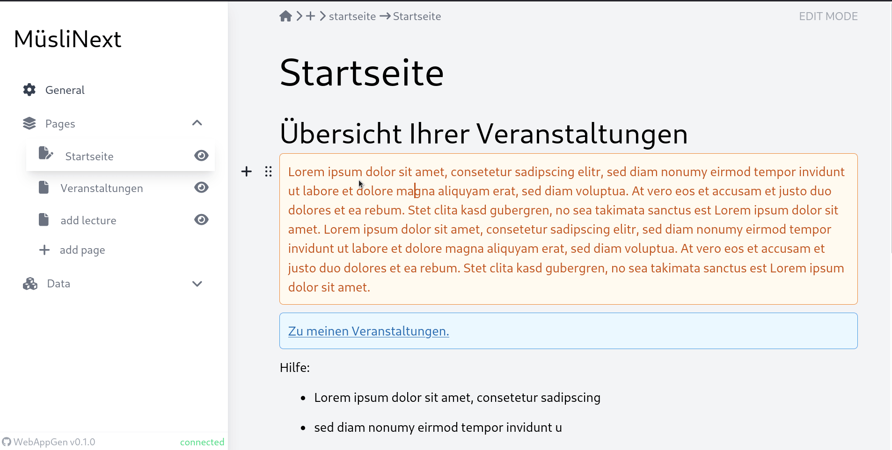

# MuesliNext


WebApp Generator with intutable as backend and react framework for frontend that can be used to generate [MÜSLI](https://github.com/muesli-hd/muesli) like apps.

## Demo



## Roadmap (in unperfect order)

- [x] static site generation (with gui, saved in local storage)
- [ ] store site in server storage rather than local storage
- [ ] include dynamic values from existing tables
- [ ] create tables on demand
- [ ] usage of predefined functions on dynamic values (e.g. sum columns)
- [ ] create functions on demand
- [ ] ...

## Installation

clone this repository

```bash
git clone git@github.com:pvs-hd-tea/MuesliNext.git
```

or via https

```bash
git clone https://github.com/pvs-hd-tea/MuesliNext.git
```

install dependencies

```bash
npm install
```

start the app

```bash
npm run dev
```

## Contributing

For contributions please follow the [contribution guideline](https://gist.github.com/buddiman/628d55d0b08ff0672af5f4c156afeb08)

Additionally you can only commit if the code following certain quality criteria.
E.g. is linted and formated correctly. To format the code automatically if possible run:

```bash
npm run format
```

You should never but could always bypass these rules with:

```bash
git commit --no-verify
```

## Running Tests

To run tests, run the following command

```bash
npm test
```

To run tests with coverage, run

```bash
npm test -- --coverage --watchAll
```

## Acknowledgements

- [React](https://github.com/facebook/react) as framework
- [Editor.js](https://github.com/codex-team/editor.js) as WYSIWYG editor
- [Zod](https://github.com/colinhacks/zod) as object parser
